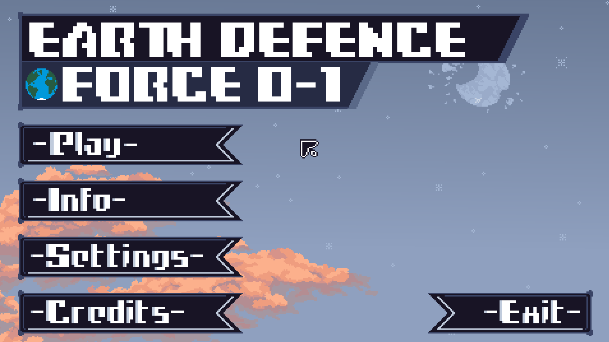
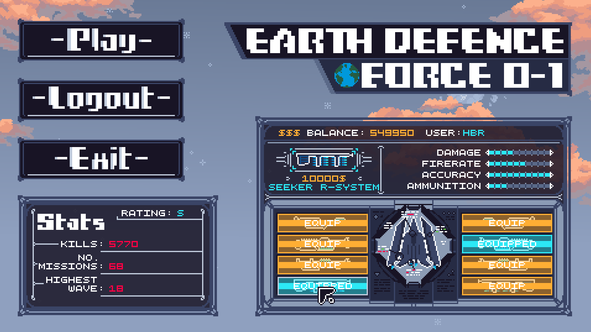
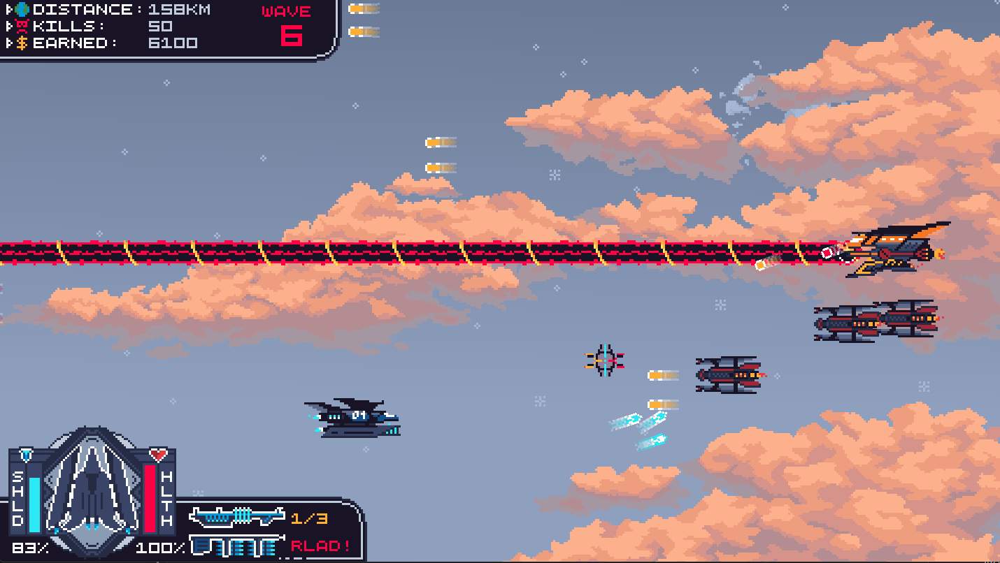

  

„Earth Defence Force 0-1” jest jednoosobową strzelanką bullethell. Jest to gra zręcznościowa, w której gracz wciela się w rolę pilota statku kosmicznego i odpiera kolejne fale przeciwników z rosnącym poziomem trudności. 
Gracz wybiera uzbrojenie do swojego statku, które jest w stanie zakupić zarabiając walutę niszcząc przeciwników.

Gra została napisana w języku C++ wykorzystując środowisko graficzne SFML. Cała oprawa graficzna oraz animacje są autorskie, natomiast efekty dźwiękowe pochodzą z darmowych bibliotek online.

